# daditto ビルドガイド

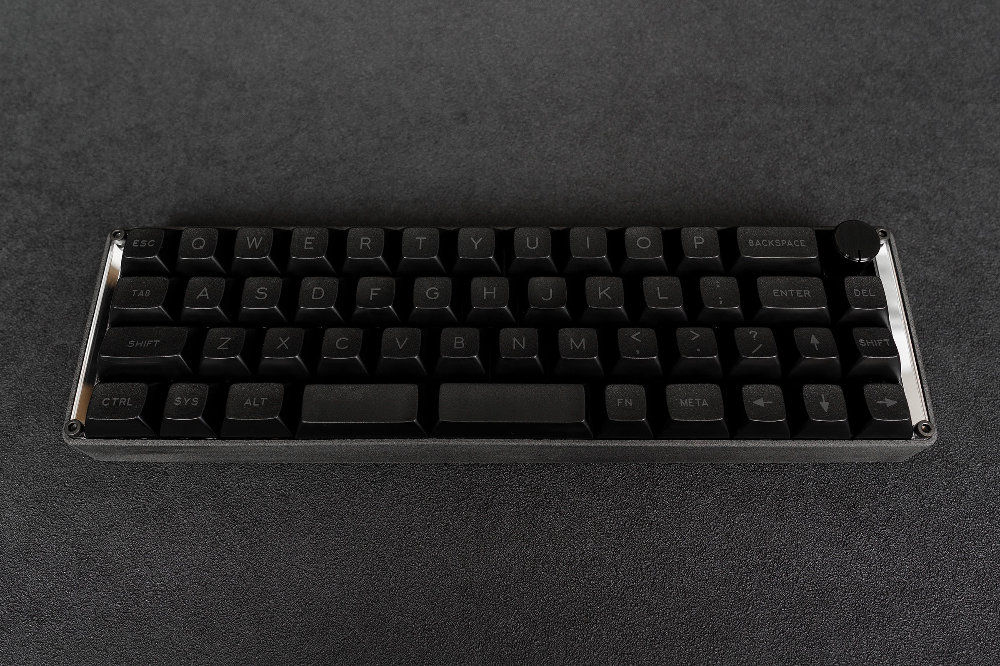

## 目次
- [0. 事前準備](#0-事前準備)
  - [0.1. キットの内容物](#01-キットの内容物)
  - [0.2. キット以外に必要な部品](#02-キット以外に必要な部品)
  - [0.3. 必要工具](#03-必要工具)
  - [0.4. アイコンの説明](#04-アイコンの説明)
- [1. 動作確認](#1-動作確認)
- [2. 組み立て](#2-組み立て--)
- [3. ファームウェア](#3-ファームウェア)
- [4. 完成](#4-完成)

---

## 0. 事前準備
### 0.1. キットの内容物

||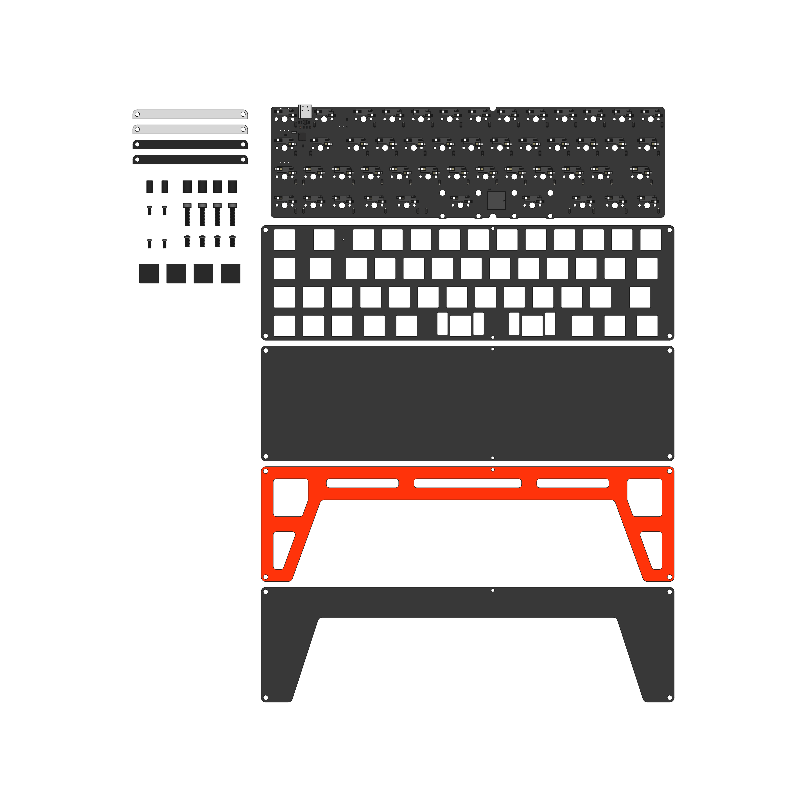|
|---|---|

||名前|数量|備考|
|:---:|:---|---:|:---|
|1|メインPCB|1||
|2|トッププレートPCB|1||
|3|ボトムプレートPCB A|1||
|4|ボトムプレートPCB B|1||
|5|ボトムプレートPCB C|1||
|6|アクセントプレート(ミラー)|2||
|7|アクセントプレート(ブラック)|2||
|8|スペーサ|4|M3 8mm(ARL-308BE)|
|9|スペーサ|2|M2 8mm(ARL-2008BE)|
|10|ネジ|4|M3 12mm(FC-0312)|
|11|ネジ|4|M3 6mm(FLA-0306EB)|
|12|ネジ|2|M2 5mm(F-0250EB-01)|
|13|ネジ|2|M2 5mm(FX-0250EB)|
|14|ゴム足 大|2|TM-166-18|
|15|ゴム足 小|2|TM-166-8|

- ※ 販売形式によっては内容が異なる場合があります。

---

### 0.2. キット以外に必要な部品

||名前|数量|備考|
|:---:|:---|---:|:---|
|1|キースイッチ|49|Cherry MX互換スイッチ|
|2|キーキャップ|49|※1|
|3|スタビライザ|2|2Uサイズ ※2|
|4|ロータリーエンコーダ|1|Alps EC12シリーズ互換 ※3 ※4|
|5|ロータリーエンコーダ用ノブ|1|※3|
|6|3Dプリントケース Aspecio Shell|1|※5|
|7|USB Type-Cケーブル|1||

- ※1 キーレイアウトは商品画像を参考にしてください。
- ※2 PCBマウントのネジ留めタイプのもののみ使用できます。
- ※3 ロータリーエンコーダを実装する場合にのみ必要です。
- ※4 プッシュスイッチ内蔵のものが使用可能です。
- ※5 購入時にダウンロードできる3Dデータからご自身で3Dプリントしてご用意ください。

---

### 0.3. 必要工具

- 温調ハンダごて ※1
  - HAKKO [FX600](https://www.hakko.com/japan/products/hakko_fx600.html)がオススメです。
- ハンダ
- ピンセット
- 六角レンチ
  - 対角 2.5mm
- SIMピン
  - リセットスイッチ押下用

- ※1 ロータリーエンコーダを実装する場合にのみ必要です。

---

### 0.4. アイコンの説明

|アイコン|説明|
|:---:|---|
||ハンダ付けを必要とします。|
||ネジ留めを必要とします。|

---

## 1. 動作確認
　まず始めにメインPCBの動作確認を行います。
お使いのPCにメインPCBをUSB Type-Cケーブルで接続して正常に認識されることを確認してください。
認識されない場合はメインPCBの不良、もしくはUSB Type-Cケーブルがデータ通信用ではない可能性があります。
正常に認識されたら[Remap](https://remap-keys.app/)へアクセスし、各キーの動作確認を行います。
初期状態では[Remap](https://remap-keys.app/)対応のファームウェアが書き込まれています。
メインPCB裏面のKailhソケットをピンセットなどの導通するものを用いて短絡させてください。
また、`Clickey Toggle`や`Music On`のキーを押すことでスピーカの動作確認を行うことができます。
各キーの動作が確認できたらメインPCBの動作確認は完了です。

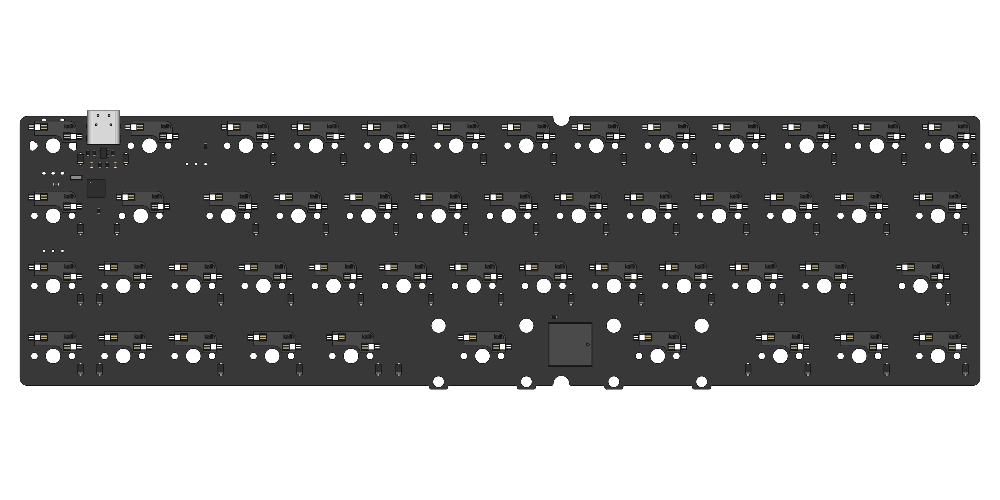

---

## 2. 組み立て  

　以下の図のとおり組み立てを行います。
本ビルドガイドの順に実装することをおすすめします。

　ロータリーエンコーダを実装します。
ロータリーエンコーダが必要ない場合はこの手順はスキップしてください。
5ヶ所のみハンダ付けするだけで十分に固定されます。
左右の太い足をハンダ付けする際は周囲の部品と短絡しないようご注意ください。

|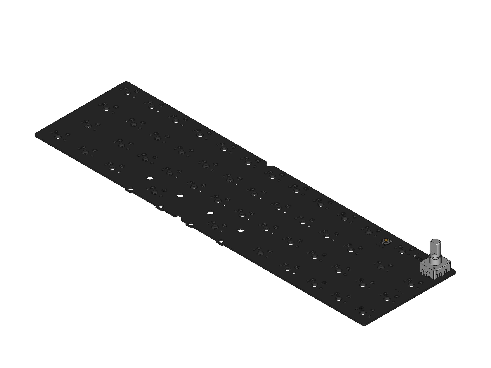|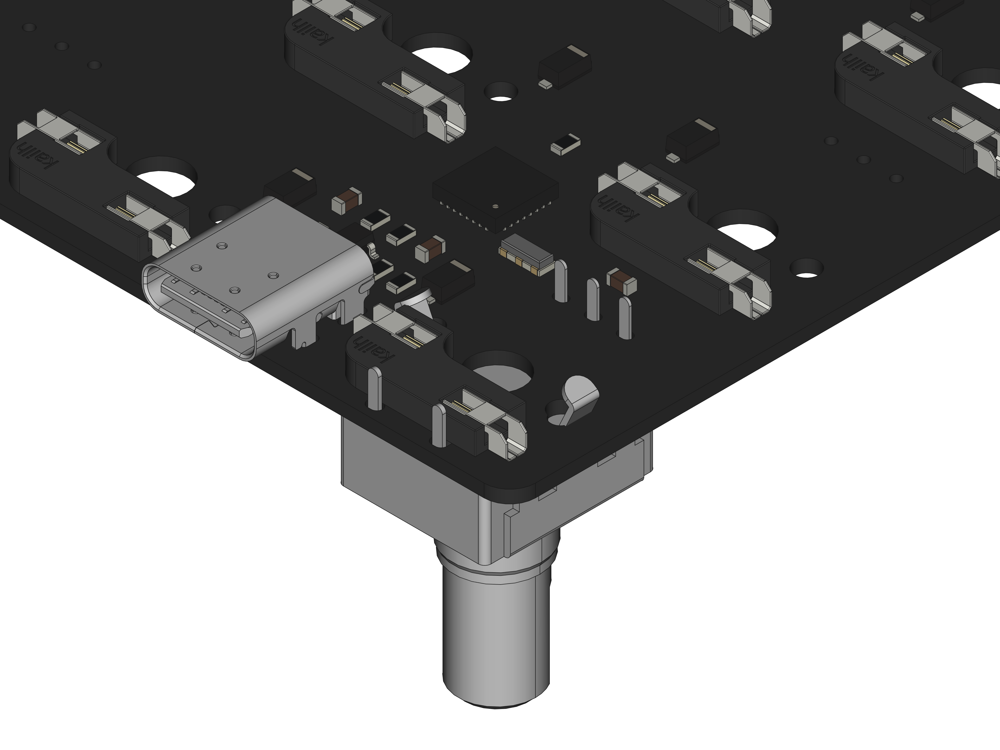|
|---|---|

　スタビライザを取り付けます。

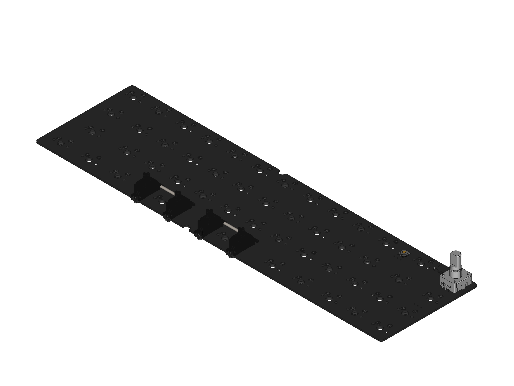

　トッププレートPCBにキースイッチを取り付けメインPCBを取り付けます。
キースイッチの足が折れ曲がらないようにご注意ください。

||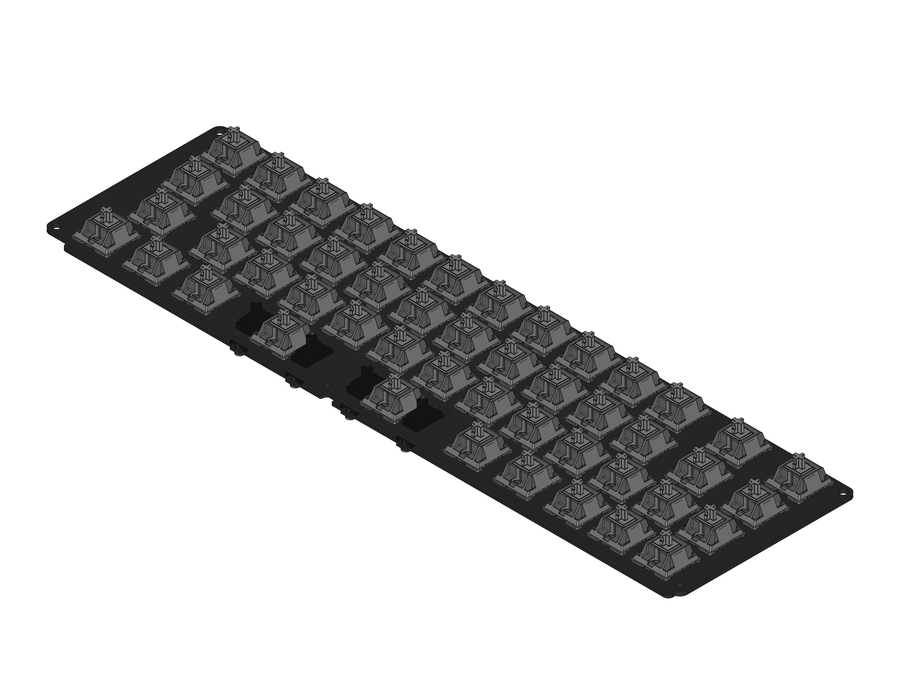|
|---|---|

　ボトムプレートを組み立てます。
各ボトムプレートPCBを重ねてネジとスペーサで6ヶ所固定します。
各ネジには頭が平らなネジを使用します。

|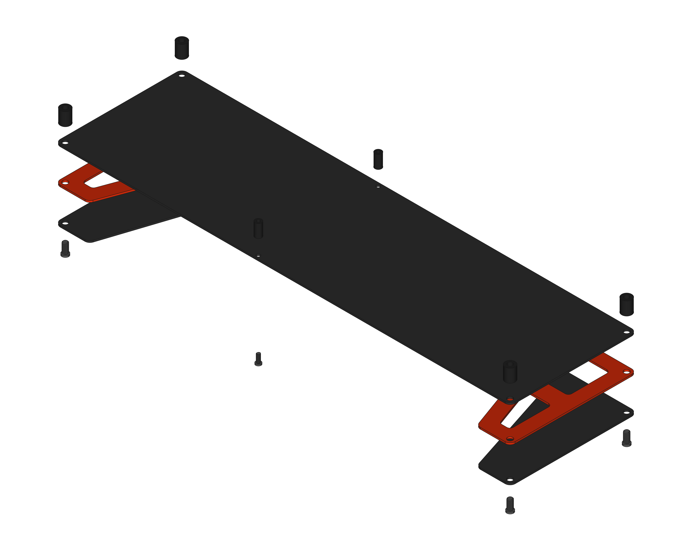|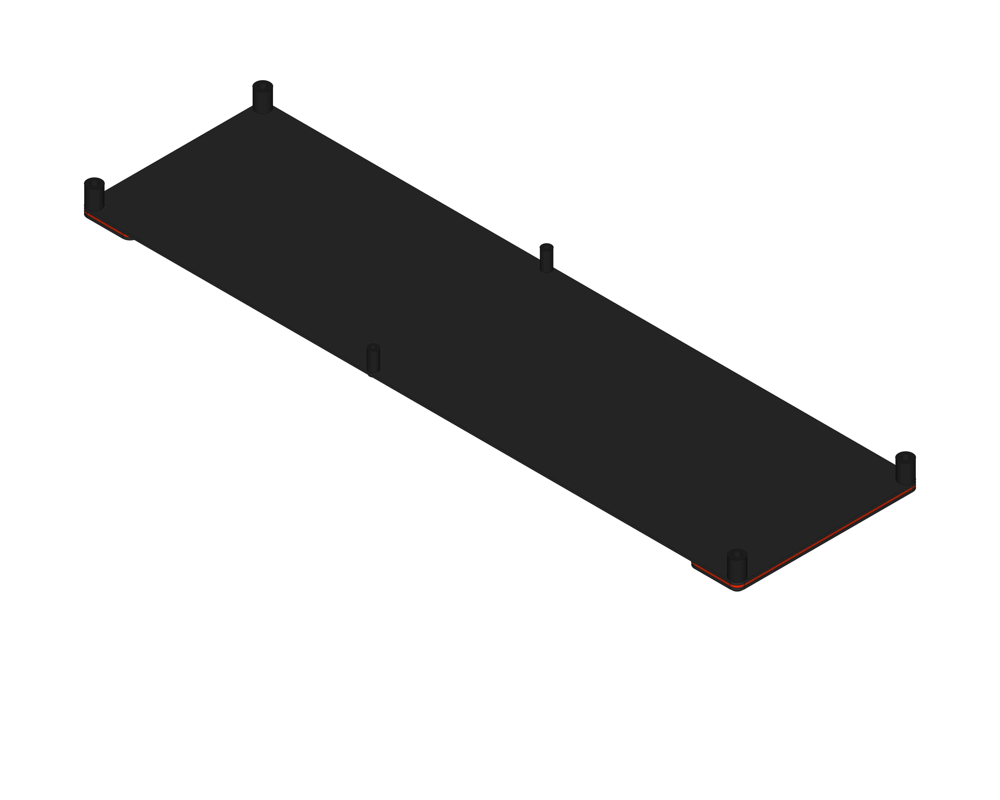|
|---|---|

　ボトムプレートが組み立てられたらゴム足を4ヶ所貼り付けます。
3Dプリントケースを使用する場合はこのときボトムプレートに取り付けます。

|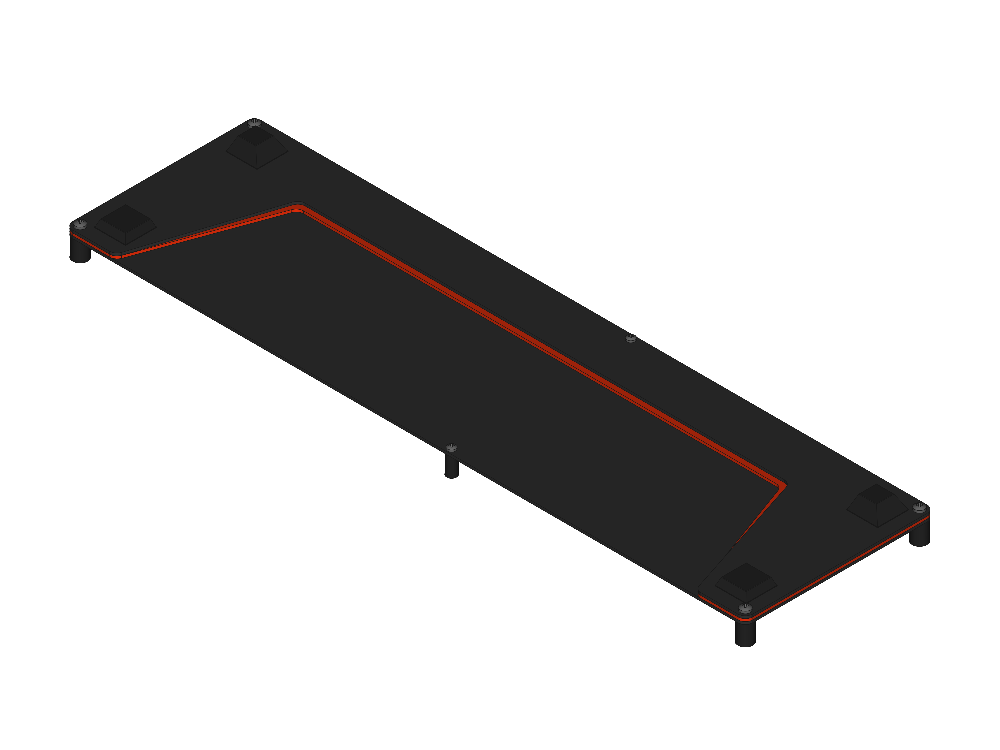|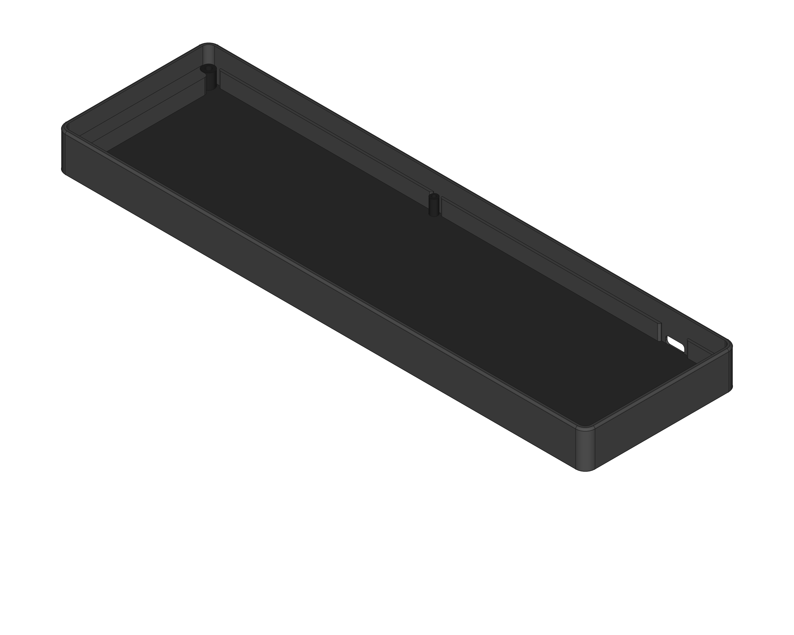|
|---|---|

　キースイッチを取り付けたメインPCBおよびトッププレートPCBにボトムプレートを取り付けます。
ネジで6ヶ所固定します。その内4ヶ所にはアクセントプレートを間に挟んで固定します。

|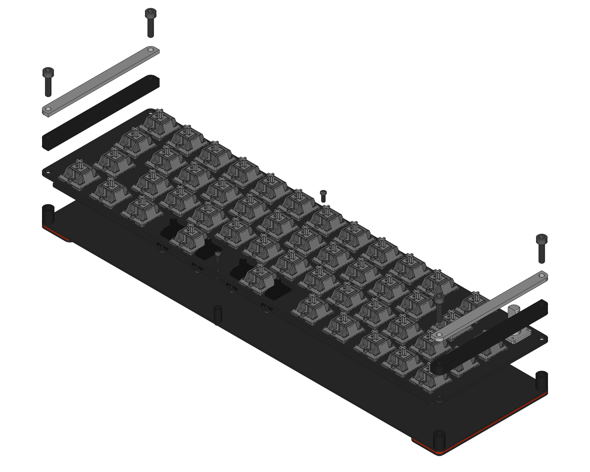||
|---|---|

キーキャップおよびロータリーエンコーダのノブを取り付けて完成です。

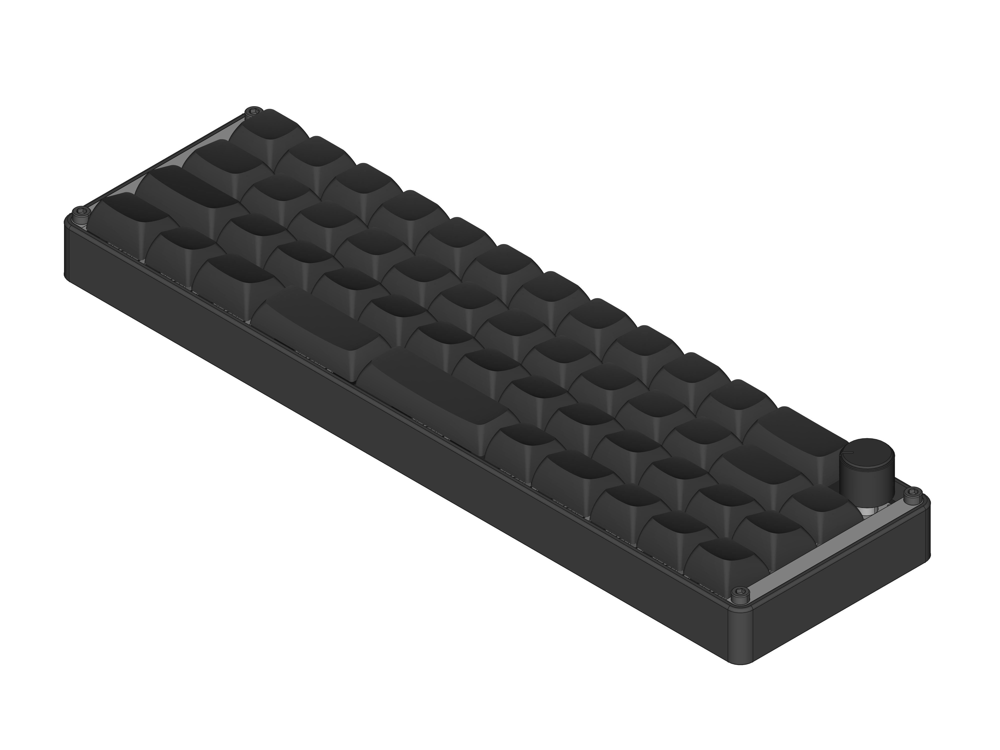

---

## 3. ファームウェア

　dadittoはQuantum Mechanical Keyboard Firmware(以下、QMK)に対応しています。
スピーカを有効にする関係上、現在はQMK公式にマージされておりません。
ご自身でビルドを行う場合は以下のリポジトリのブランチをご利用ください。

- yynmt/qmk_firmware at daditto\
[https://github.com/yynmt/qmk_firmware/tree/daditto](https://github.com/yynmt/qmk_firmware/tree/daditto)

---

## 4. 完成

完成です。
かっこよく仕上がったでしょうか？
納得できる仕上がりでしょうか？
お手元にスマホやカメラはありますか？
最後の仕上げに写真を撮りましょう。
そしてSNSへ`#daditto`のタグと共に投稿してください。
必ず行ってください。

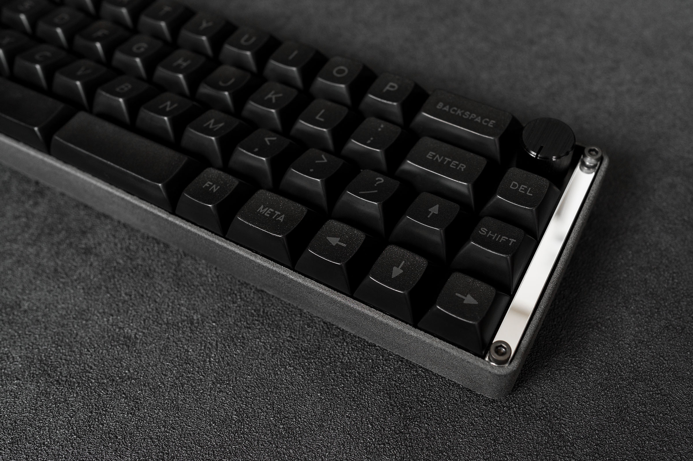

　ところで、お家のキーボード棚にdadittoを飾るスペースは空いていますか？
もしスペースが空いていないようであれば是非、お好みのキーレイアウトに変更して使ってみてください。
動作確認でも利用した[Remap](https://remap-keys.app/)を利用するととても簡単にキーレイアウトを変更できます。

本ビルドガイドは[Acperience70](http://yynmt.com/kb/a70.html)で書かれました。
